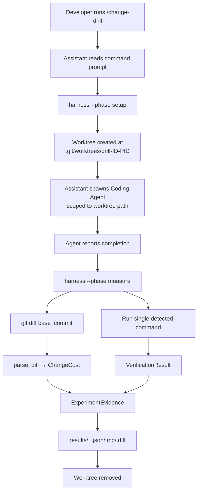
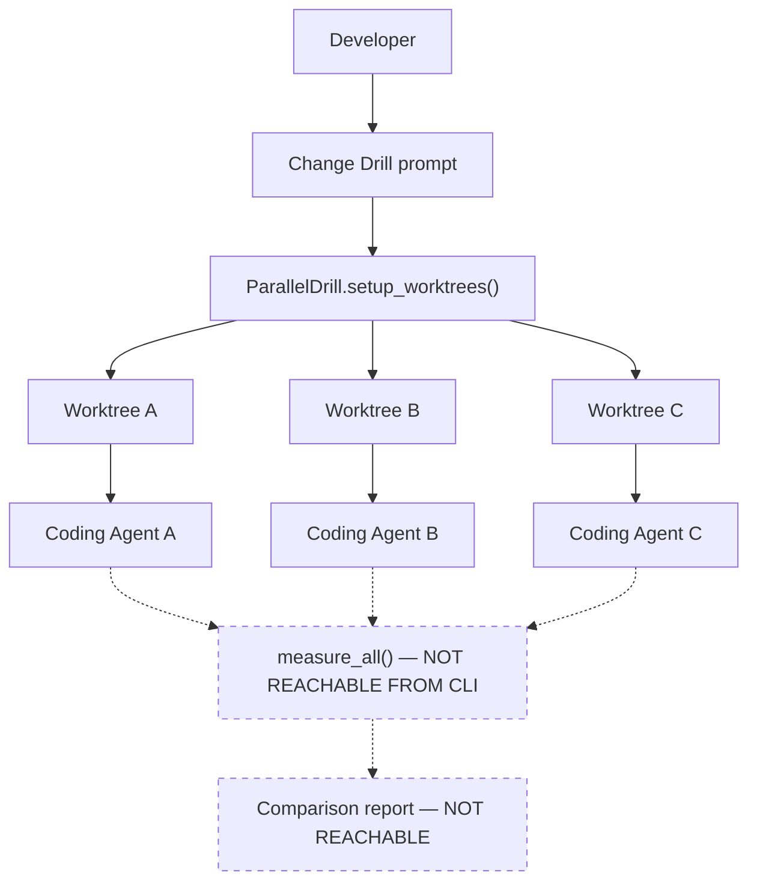

# System Architecture: Clean Code Change Lab

> **Scope note:** This document describes the architecture **as currently implemented**.
> Where a designed capability is not yet wired up, it is marked explicitly.

## Execution Model

`/change-drill` is not a single program. It is a **prompt file**
([`.claude/commands/change-drill.md`](../.claude/commands/change-drill.md)) that instructs the
Claude assistant to invoke a Python harness in phases. Responsibility is split:

| Concern | Owner |
|---|---|
| Scenario selection, worktree lifecycle, measurement, verification, reporting | Python harness (`src/`) |
| Coding Agent invocation, phase sequencing, passing values between phases | Claude assistant, driven by the prompt file |

**The harness never invokes a Coding Agent.** There is no `Task`, subprocess, or API call to any
agent anywhere in `src/`. This is the single most important thing to understand about the
architecture: the harness measures a worktree, it does not orchestrate the actor that changes it.

## Single-Agent Flow (fully implemented)



### Phase boundaries

The two harness invocations are **separate OS processes with no shared state**. The assistant must
carry `worktree_path` and `base_commit` from the setup output into the measure invocation. Nothing
is persisted to disk between phases.

`--phase full` exists but does **not** pause for an agent — it creates the worktree and measures on
the next statement, always yielding an empty diff. It is not usable for real drills.

## Parallel Agent Model (partially implemented)



Dashed nodes are implemented in `src/parallel.py` and `src/analysis.py` but **cannot be reached
through the CLI**. `--phase measure --parallel N` constructs a fresh `ParallelDrill` whose worktree
map is empty, so it always terminates with:

```
Error: Harness not properly initialized. Call setup_worktrees() first.
```

Consequently, in parallel mode: no measurement runs, no comparison report is produced, and
**worktrees are not cleaned up**.

### Parallel status summary

| Capability | Status |
|---|---|
| Create N isolated worktrees | ✅ Implemented |
| Concurrent agent execution | ⚠️ Assistant-driven, outside the harness |
| Per-agent measurement | ❌ Unreachable from CLI |
| Cross-agent comparison (`analysis.py`) | ❌ Unreachable from CLI |
| Automatic worktree cleanup | ❌ Manual cleanup required |

## Agent Execution Constraints

### Parallel Agent Limits

| Configuration | Value | Enforced? |
|---|---|---|
| Minimum agents | 1 | — |
| CLI default | 1 | ✅ `--parallel` defaults to `1` |
| Recommended for parallel mode | 3 | ❌ Convention only |
| Maximum agents | 3 | ❌ **Not enforced** — no range validation exists |
| Execution mode | Concurrent | ⚠️ Property of the prompt, not a harness guarantee |

`--parallel 4` and above are accepted and will create that many worktrees.

### Isolation Guarantees

- **Per-Agent Worktree** ✅ — each agent gets its own `git worktree add --detach` checkout
- **No Cross-Access** ✅ — worktrees are separate directories; scoping relies on the agent honoring
  the path constraint in its prompt
- **Original Repository** ✅ — never modified; worktrees are detached checkouts. Note that worktree
  metadata is written under the target repo's `.git/worktrees/`, which `git status` does not show
- **Independent Verification** ⚠️ — true for the single-agent path only; unreachable in parallel

### Scaling Notes

- **Verified**: single-agent path, end to end
- **Design capacity**: up to 3 agents concurrently
- **Beyond 3**: not supported (and not currently blocked by code)
- **Rationale**: balances concurrent evidence collection against system resource constraints

## Measurement Architecture

```
git diff <base_commit>  →  parse_diff()  →  ChangeCost
```

Known structural limits of this pipeline:

- `git diff <commit>` **excludes untracked files**. Files an agent newly creates are invisible to
  measurement unless staged.
- Per-file `lines_added` / `lines_deleted` are always `0`; only repository-wide totals are counted.
- `FileDiff.status` is always `"M"`; renames, additions, and deletions are not distinguished.
- `FileDiff.is_test_file` is never assigned, so the `(test)` marker in Markdown reports never
  renders. The aggregate `test_files_changed` count is computed correctly and separately.
- `unrelated_files_modified` is hardcoded to `0`; no relatedness analysis exists.

## Verification Architecture

**One command is detected and run — not two.**

`detect_build_command()` inspects the **original repository** (not the worktree) in this order:

| Marker | Command |
|---|---|
| `Makefile` | `make` |
| `package.json` | `npm test` |
| `pytest.ini` / `setup.py` / `requirements.txt` | `python -m pytest` |
| *(none)* | `make` (fallback) |

That single command is then executed inside the worktree. Test success is **derived, not measured**:

```python
build_success = result.returncode == 0
if build_success:
    test_success = True     # mirrored from build, not independently verified
```

`test_command` is always `""`. A report showing `Tests: ✓` conveys no information beyond
`Build: ✓`. Completion is therefore `completed = build_success`, in effect.

There is no exception handling around the 300-second subprocess timeout; a timeout or missing
binary propagates to the caller's generic handler.

## Reporting

| Artifact | Path | Notes |
|---|---|---|
| Structured evidence | `results/<id>_<ts>.json` | Diff excluded |
| Human report | `results/<id>_<ts>.md` | Diff truncated to 1000 chars, build output to 500 |
| Raw diff | `results/<id>_<ts>.diff` | Full |

Parallel mode would write to `results/agent_<ID>/` and `results/comparison/`; neither directory
exists, consistent with that path never having executed.

## Not Implemented

The following appear in product documentation but have no implementation:

- Sub-agent decomposition (Scenario / Verification / Measurement / Analysis Agents) — these are
  plain Python functions, not agents
- Free-text scenario input — only catalog IDs are accepted
- Clean-working-tree precondition check
- Cross-run or cross-scenario comparison
- Multi-scenario parallel execution
- Hook / scheduled automation
- Layer-and-module propagation analysis
- Any runtime data-flow visualization
