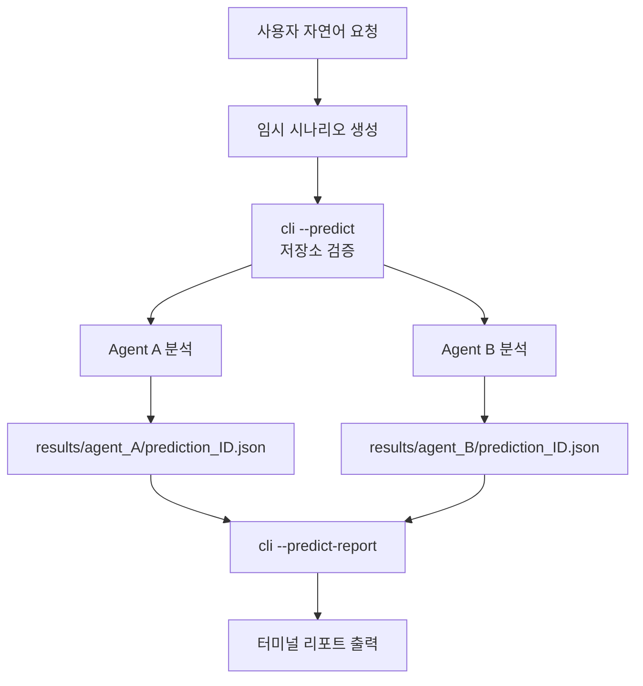
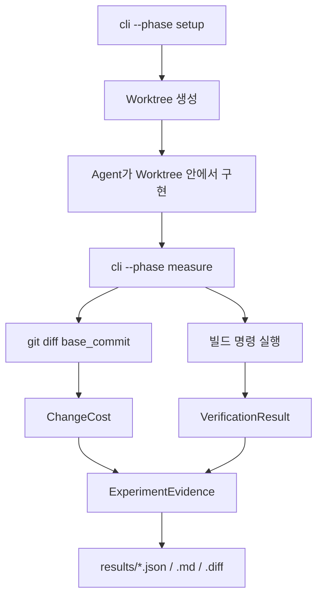

# 시스템 설계

## 실행 모델

`/change-drill`은 하나의 프로그램이 아니라 **프롬프트 파일**
([`.claude/commands/change-drill.md`](../.claude/commands/change-drill.md))이다.
책임은 둘로 나뉜다.

| 담당                                            | 주체              |
| ----------------------------------------------- | ----------------- |
| 저장소 검증, Worktree 관리, 측정, 리포트 렌더링 | Python (`src/`)   |
| Agent 호출, 단계 순서 제어, 단계 간 값 전달     | Claude 어시스턴트 |

**Python 코드는 Agent를 호출하지 않는다.** `src/` 어디에도 Agent 호출은 없다.

## 모듈 구성

| 파일                   | 역할                                                    |
| ---------------------- | ------------------------------------------------------- |
| `cli.py`               | 진입점. 모드 분기(예측 / 예측 리포트 / 단일 / 병렬)     |
| `prediction.py`        | `AgentPrediction`, `PredictionComparison`, 예측 집계    |
| `prediction_report.py` | **예측 터미널 리포트 렌더링 (형식의 단일 진실 공급원)** |
| `worktree.py`          | Git worktree 생성·정리                                  |
| `measurement.py`       | `git diff` 파싱, 빌드 검증                              |
| `analysis.py`          | Agent 간 비교 분석                                      |
| `harness.py`           | 단일 Agent 실험 조율                                    |
| `parallel.py`          | 병렬 Agent 실험 조율                                    |
| `report.py`            | 구현 모드 결과 저장 (JSON/MD/diff)                      |

## 예측 모드 (읽기 전용)



- `--predict`: 저장소 검증 + 실행 상태 저장. Worktree 없음, 리포트 없음.
- `--predict-report`: 저장된 JSON을 읽어 집계·출력. Agent 실행 없음, 저장소 접근 없음.
  독립 실행 가능하며, 증거가 없거나 손상되면 종료 코드 1을 반환한다.

두 단계를 분리한 이유: **리포트 형식이 Claude의 비결정적 출력에 좌우되지 않게 하기 위함.**

## 구현 모드



setup과 measure는 **상태를 공유하지 않는 별개 프로세스**다.
어시스턴트가 `worktree_path`와 `base_commit`을 전달해야 한다.
병렬 모드의 measure는 `discover_worktrees()`로 worktree를 다시 찾아 동작한다.

## 측정 파이프라인의 한계

- `git diff <commit>`은 **untracked 파일을 제외한다.** Agent가 새로 만든 파일은 stage하지 않으면 안 보인다.
- 파일별 `lines_added` / `lines_deleted`는 항상 `0`. 저장소 전체 합계만 집계된다.
- `FileDiff.status`는 항상 `"M"`. 추가·삭제·이름변경을 구분하지 않는다.
- `unrelated_files_modified`는 `0` 고정. 연관성 분석은 없다.

## 검증의 한계

빌드 명령 **하나만** 탐지해서 실행한다 (`Makefile` → `make`, `package.json` → `npm test`,
`pytest.ini`/`setup.py`/`requirements.txt` → `python -m pytest`, 없으면 `make`).

```python
build_success = result.returncode == 0
if build_success:
    test_success = True   # 빌드 결과를 복사할 뿐, 별도 검증 아님
```
