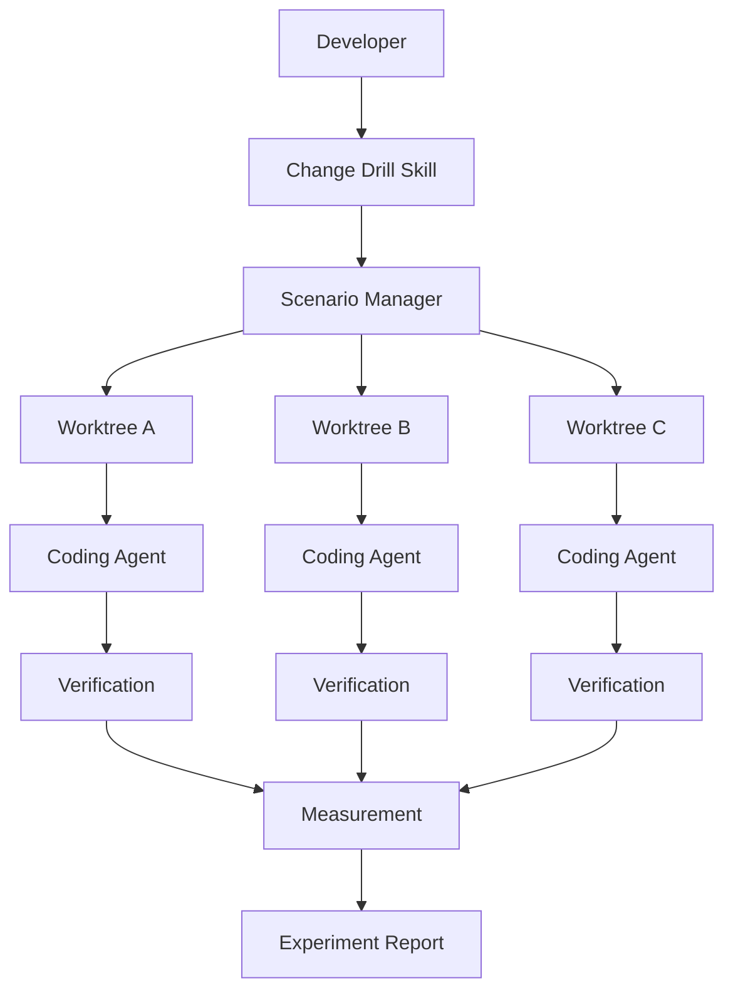

```mermaid
flowchart TD
    A[Developer] --> B[Change Drill Skill]
    B --> C[Scenario Manager]
    C --> D[Worktree A]
    C --> E[Worktree B]
    C --> F[Worktree C]
    D --> G[Coding Agent]
    E --> H[Coding Agent]
    F --> I[Coding Agent]
    G --> J[Verification]
    H --> K[Verification]
    I --> L[Verification]
    J --> M[Measurement]
    K --> M
    L --> M
    M --> N[Experiment Report]
```
