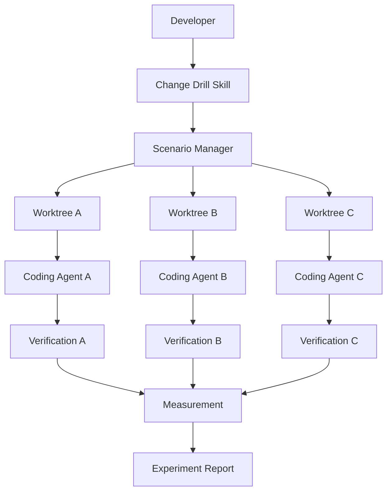

# System Architecture: Clean Code Change Lab

## Parallel Agent Model

### Architecture Diagram

## Agent Execution Constraints

### Parallel Agent Limits

| Configuration | Value |
|---|---|
| Minimum agents | 1 |
| Default agents | 3 |
| Maximum agents | 3 |
| Execution mode | Concurrent (not sequential) |

### Isolation Guarantees

- **Per-Agent Worktree**: Each agent gets its own isolated Git worktree
- **No Cross-Access**: Agents cannot access or modify each other's worktrees
- **Original Repository**: Always remains unmodified during experiments
- **Independent Verification**: Each agent's results measured independently

### Scaling Notes

- **Current**: Tested with 2 agents concurrently
- **Design capacity**: Up to 3 agents concurrently
- **Beyond 3**: Not supported in this architecture (requires redesign)
- **Rationale**: Balances concurrent evidence collection with system resource constraints
