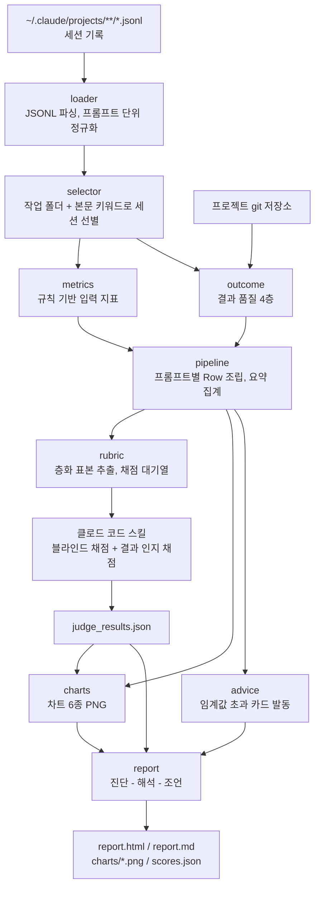
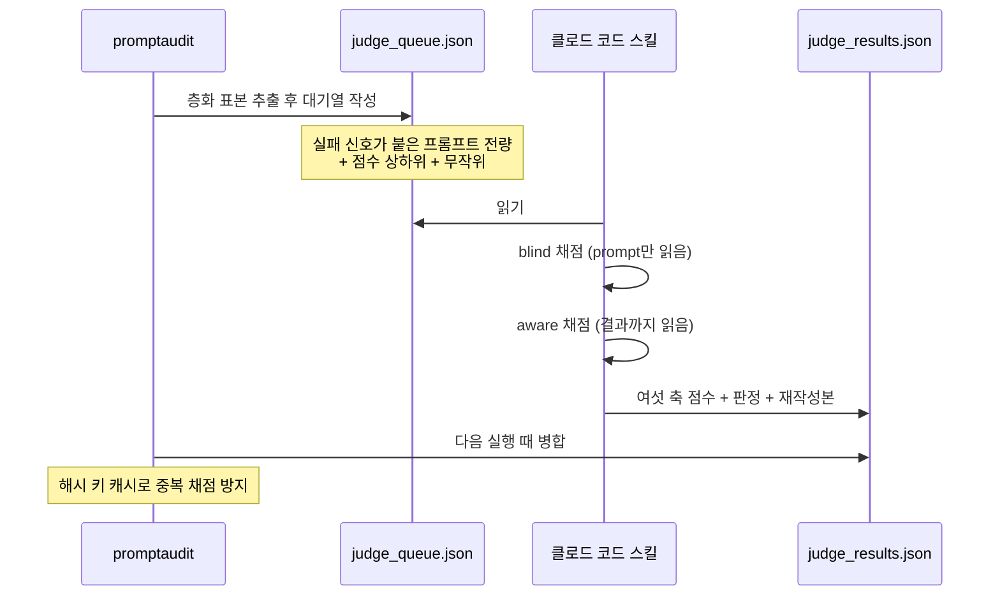

# 시스템 설계도

## 1. 전체 흐름



규칙 계층(loader ~ advice)은 LLM을 쓰지 않는다. 몇 번을 돌려도 같은 수치가
나오므로 발표 중 재현 시연이 가능하다. LLM은 rubric 단계에만 개입한다.

## 2. 데이터 모델

세션 파일은 한 줄에 레코드 하나씩 들어 있는 JSONL이다. 이 레코드들을 **프롬프트
단위**로 접는 것이 loader의 일이다.

```
PromptUnit = 사람이 입력한 프롬프트 하나
           + 다음 사람 프롬프트가 나오기 전까지의 모든 응답과 도구 호출
```

| 필드 | 의미 |
| --- | --- |
| `text` | 프롬프트 원문 |
| `assistant_turns` | 그 프롬프트에 대해 모델이 응답한 턴 수 |
| `tool_calls` | 호출한 도구 목록. 각각 성패가 붙는다 |
| `output_tokens` 외 | 토큰 사용량 |
| `interrupted` | 사용자가 중간에 작업을 끊었는지 |
| `edited_files` | 그 사이 수정된 파일 경로 |

## 3. 파싱에서 반드시 지켜야 하는 네 가지

실제로 걸렸던 함정이며, 하나라도 놓치면 지표가 통째로 어긋난다.

| 함정 | 대응 |
| --- | --- |
| PowerShell `Get-Content`가 기본 ANSI로 읽어 한글을 깨뜨린다 | 파싱은 파이썬에서 `encoding="utf-8"`로만 한다 |
| 도구 실행 결과도 `type: "user"` 레코드로 들어온다 | `origin.kind == "human"`인 것만 사람 프롬프트로 센다 |
| 세션마다 메모리 파일이 주입되어 키워드 검색이 오염된다 | 키워드 스캔은 사람 프롬프트 본문에만, `system-reminder` 블록을 뺀 뒤 적용한다 |
| 서브에이전트 대화가 섞여 있다 | `isSidechain: true` 레코드는 본 지표에서 제외한다 |

## 4. 점수 계산

### 프롬프트 점수 (입력 축, 0~100)

기본값 55점에서 시작해 가감한다.

| 항목 | 가감 |
| --- | --- |
| 파일 경로 포함 | +12 |
| 코드 블록 또는 에러 원문 포함 | +10 |
| 범위 제한 표현 포함 | +8 |
| 요청 동사 포함 | +5 |
| 모호어 1개당 | -6 |
| 대상 없이 15자 미만 | -14 |
| 요청 동사 3개 이상 | -10 |
| 범위 제한 없이 파일 수정 | -6 |
| 1,500자 초과 | -8 |

### 결과 점수 (결과 축, 0~100)

네 층을 가중 합산한다.

| 층 | 비중 | 계산 |
| --- | --- | --- |
| 즉시 성공 | 0.35 | 도구 에러율에서 감점, 사용자 중단 시 큰 폭 감점 |
| 수렴 비용 | 0.25 | 턴 수, 도구 호출 수, 같은 파일 재편집 횟수에서 감점 |
| 지속성 | 0.20 | 수정한 파일 중 이후 커밋에 등장한 비율 |
| 사용자 수용 | 0.20 | 승인 100, 중립 60, 정정 15 |

파일을 건드리지 않은 프롬프트는 지속성 개념이 없으므로 중립값을 준다. 질의응답만
한 프롬프트가 부당하게 낮은 점수를 받지 않도록 하기 위한 처리다.

## 5. 채점 계층



블라인드 채점에서 결과를 보지 않는 것이 이 설계의 핵심이다. 결과를 먼저 보면
채점이 결과에 끌려가고, 두 점수의 차이라는 정보가 사라진다.

## 6. 모듈 책임

| 모듈 | 책임 |
| --- | --- |
| `loader.py` | JSONL 스트리밍 파싱, 프롬프트 단위 정규화, 깨진 줄 방어 |
| `selector.py` | 프로젝트별 세션 선별 규칙 |
| `metrics.py` | 규칙 기반 입력 지표와 안티패턴 판정 |
| `outcome.py` | 결과 품질 4층, git 커밋 대조 |
| `pipeline.py` | 위 결과를 프롬프트별로 조립하고 전체 요약을 낸다 |
| `rubric.py` | 층화 표본, 채점 대기열, 결과 병합과 캐시 |
| `masking.py` | 인용 전 비밀값 마스킹 |
| `charts.py` | 차트 6종 생성, PNG 저장과 base64 임베드 |
| `advice.py` | 임계값 규칙과 조언 카드 발동 |
| `report.py` | 진단 - 해석 - 조언 3부 구조의 HTML/Markdown 생성 |

## 7. 조언 발동 규칙

조언은 고정 문구가 아니라 규칙표에서 나온다. 각 규칙은 지표 하나와 임계값,
그리고 임계값을 얼마나 크게 넘겼는지를 나타내는 심각도를 가진다. 최종 순서는
심각도와 규칙 자체의 중요도를 곱한 값으로 정한다.

| 규칙 | 지표 | 임계값 |
| --- | --- | --- |
| 요구를 쪼갠다 | 재작업률 | 8% 이상 |
| 컨텍스트를 붙인다 | 컨텍스트 제공률 | 40% 미만 |
| 실행 전 계획을 확인한다 | 중단률 | 5% 이상 |
| 실행 전 상태를 확인한다 | 도구 에러율 | 4% 이상 |
| 완료 기준을 적는다 | 명시적 승인률 | 10% 미만 |
| 목표를 하나만 담는다 | 요구 다중 프롬프트 비율 | 8% 이상 |
| 한 줄 지시에 대상을 적는다 | 지나치게 짧은 프롬프트 비율 | 7% 이상 |
| 범위를 못 박는다 | 범위 미지정 수정 비율 | 8% 이상 |
| 긴 사양은 문서로 넘긴다 | 초장문 프롬프트 비율 | 4% 이상 |
| 맥락 의존을 줄인다 | 문장 나쁨-결과 좋음 비율 | 35% 이상 |
