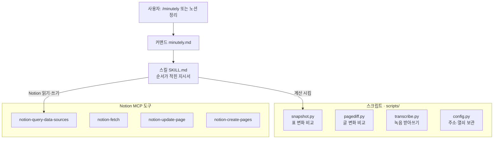
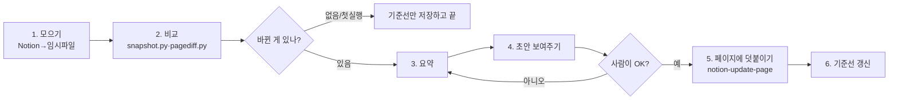
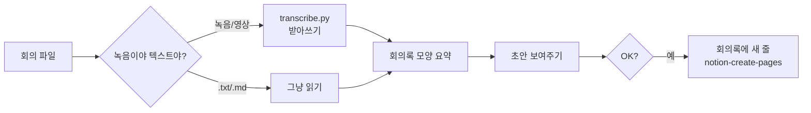

# Minutely 팀원 가이드 (입문자용)

Claude Code 플러그인을 처음 보는 팀원도 "아, 이건 이렇게 돌아가는구나"를 알 수 있게 쉽게 정리했습니다.
어려운 말엔 항상 괄호로 비유를 붙였습니다.

---

## 1. 이 플러그인 뭐예요?

**Minutely**는 우리 팀 Notion을 대신 정리해 주는 도우미입니다. 두 가지 일을 합니다.

- **경로 A — 노션 변경 정리**: `C조_한컴` 페이지에서 **뭐가 바뀌었는지**를 찾아서,
  **"노션 변경 내용 정리 (Claude 전용)"** 페이지에 날짜별로 적어 둡니다.
  *(비유: 어제 문서와 오늘 문서를 나란히 놓고 "틀린 그림 찾기" 해서 바뀐 것만 메모.)*
- **경로 B — 회의록 작성**: 회의 **녹음 파일이나 메모 텍스트 파일**을 주면,
  받아쓰고 요약해서 **회의록** 표에 새 줄로 넣어 줍니다.
  *(비유: 녹음을 받아쓰고 핵심만 추려 회의록에 대신 적어 주는 서기.)*

> 중요: 어느 경우든 **초안을 먼저 보여주고, 사람이 "OK" 해야만** Notion에 씁니다. 멋대로 안 씁니다.

---

## 2. 먼저 알아두면 좋은 용어

Claude Code "플러그인"은 몇 가지 부품으로 이뤄집니다. 쉬운 비유로:

| 용어 | 한 줄 비유 | minutely엔? |
|---|---|---|
| **커맨드(command)** | 리모컨 버튼 (`/minutely` 누르면 시작) | ✅ 1개 |
| **스킬(skill)** | 요리 **레시피(순서가 적힌 지시서)** | ✅ 1개 |
| **에이전트(agent)** | 따로 파견하는 **부하 직원**(하위 AI) | ❌ 없음 |
| **훅(hook)** | 특정 순간 자동으로 켜지는 **자동 스위치** | ❌ 없음 |
| **MCP** | 바깥 서비스로 연결되는 **콘센트/플러그**(여기선 Notion) | 🔌 외부 Notion 사용 |
| **스크립트(script)** | 계산을 대신하는 **계산기 부품**(작은 파이썬 프로그램) | ✅ 4개 |

**핵심**: minutely는 **스킬 1개 + 커맨드 1개 + 스크립트 4개**로 되어 있고,
**에이전트와 훅은 없습니다.** Notion은 플러그인 안에 든 게 아니라 **바깥 커넥터(콘센트)** 를 꽂아 씁니다.

---

## 3. 한눈에 보기



지휘자는 **스킬(지시서)**, 실제로 움직이는 손발은 **Claude**, 계산은 **스크립트**, Notion 읽고 쓰는 건 **MCP 도구**입니다.

---

## 4. 스킬이 일하는 방식 (쉽게)

스킬 파일(`SKILL.md`)은 **프로그램이 아니라 "이렇게 해"라고 적힌 지시서**입니다.
누가 `/minutely`를 누르거나 "노션 정리"라고 하면, Claude가 이 지시서를 펴서 **위에서 아래로 순서대로** 따라 합니다.

### 경로 A가 한 번 도는 이야기

1. **모으기** — Notion에서 표(소스 DB 5개)와 페이지 글을 긁어와 컴퓨터에 임시 저장.
2. **비교** — 저번에 저장해 둔 것과 지금 것을 스크립트로 대조 → **바뀐 것만** 추림.
3. **요약** — 표 태그 같은 잡음은 버리고, 의미 있는 변경·"미결정" 사항만 골라 정리.
4. **초안 보여주기** — "이렇게 적을게요" 하고 **채팅에 먼저** 보여줌.
5. **OK 받으면 쓰기** — 승인하면 "노션 변경 내용 정리(Claude 전용)" 페이지 **맨 끝에 덧붙임**.
6. **기준선 갱신** — 이번에 본 상태를 "다음번 비교 기준"으로 저장.



> **첫 실행**은 비교할 "저번 것"이 없으니, 기준선만 만들고 "다음부터 정리할게요"라고 끝납니다. 정상입니다.

---

## 5. 경로 B가 도는 이야기

회의 **녹음/텍스트 파일**을 주면:

1. **글로 바꾸기** — 녹음이면 받아쓰고(`transcribe.py`), 텍스트 파일이면 그냥 읽음.
2. **회의록 모양으로 요약** — 회의명·날짜·내용·상태로 정리(기존 회의록 말투 따라감).
3. **OK 받으면** 회의록 표에 **새 줄**로 넣음.



---

## 6. 스크립트 4개 — "이 애는 ~하는 애"

모두 `skills/minutely/scripts/`에 있는 작은 파이썬 프로그램입니다. **외부 설치 없이** 기본 파이썬으로 돕니다.

### 📄 snapshot.py — "표 변화를 찾는 애"
- **하는 일**: 저번에 저장한 표 내용과 지금 표를 비교해 **추가/수정/삭제**된 줄을 뽑음.
- **입력 → 출력**: `.minutely/current.json`(지금) vs `.minutely/snapshot.json`(저번) → 변경 목록.
- **직접 확인**: `python skills/minutely/scripts/tests/test_snapshot.py` (테스트 8개 통과 보면 이해됨).

### 📄 pagediff.py — "글(산문) 변화를 찾는 애"
- **하는 일**: 표가 아닌 **페이지 본문 글**은 통째로 이전/현재를 비교해 바뀐 문장을 `[+]`(추가)·`[-]`(삭제)로 보여줌.
- **왜 따로?**: 페이지가 커서(수만 자) 표 비교만으론 글 변화를 못 잡기 때문.
- **똑똑한 점**: 너무 짧은 조각(표 태그 재배치 등)은 잡음으로 보고 버림.

### 📄 transcribe.py — "녹음을 받아쓰는 애"
- **하는 일**: `ffmpeg`로 소리를 뽑아 **Gemini**(열쇠 있으면 우선) 또는 **OpenAI Whisper**에 보내 글로 받아씀. 긴 녹음은 잘라서 여러 번 보냄.
- **필요한 것**: `GEMINI_API_KEY` 또는 `OPENAI_API_KEY`(열쇠) + `ffmpeg`(소리 처리 프로그램). 없으면 친절히 안내하고 멈춤.

### 📄 config.py — "주소록 & 열쇠 보관하는 애"
- **하는 일**: Notion 페이지·DB의 **주소(id)** 를 상수로 모아두고, `OPENAI_API_KEY`/`GEMINI_API_KEY`(열쇠)를 찾아 읽어줌.
- **왜 중요**: 다른 스크립트·스킬이 "어디에 쓰지?"를 여기서 참고. 주소가 바뀌면 여기만 고치면 됨.

*(추가로 `tests/test_snapshot.py`는 snapshot.py가 잘 도는지 검사하는 **자동 채점표**입니다.)*

---

## 7. 에이전트·훅은 왜 없나요?

- **에이전트(하위 AI 직원)**: 복잡한 일을 여러 갈래로 나눠 시킬 때 씁니다. minutely는 절차가 한 줄기라
  **스킬 하나로 충분**해서 안 만들었습니다.
- **훅(자동 스위치)**: "세션 시작 때 자동으로 뭐 검사" 같은 걸 넣을 때 씁니다. 지금은 단순하게 가려고 뺐습니다.

둘 다 **나중에 필요하면 붙일 수 있습니다** (예: 대용량 페이지 요약 전담 에이전트, 시작 시 커넥터 점검 훅).

---

## 8. 직접 확인·분석하는 법

플러그인을 믿기 전에 직접 열어보세요.

- **레시피 읽기**: `skills/minutely/SKILL.md` — 스킬이 시키는 순서가 사람 글로 다 적혀 있습니다.
- **스크립트 열기**: `skills/minutely/scripts/*.py` — 각 파일 맨 위 주석(""" ... """)에 역할 설명.
- **테스트 돌려보기**:
  ```bash
  python skills/minutely/scripts/tests/test_snapshot.py
  ```
  `OK`가 뜨면 표 비교 로직이 정상.
- **상태 파일 보기**: 실행 후 생기는 `.minutely/` 폴더(스냅샷·임시 dump). git엔 안 올라갑니다.
- **안전장치 확인**: SKILL.md 맨 아래 "원칙" — 승인 없이는 절대 안 쓰고, 없는 내용은 지어내지 않음.

---

## 9. 더 깊이

- [기획서](기획서.md) — 왜 이렇게 만들었나(설계 결정·한계)
- [설치 및 적용 방법](설치_및_적용방법.md) — 설치·환경설정·문제 해결
- [스킬·스크립트 상세](스킬_상세.md) — 단계별·함수 단위 기술 상세
